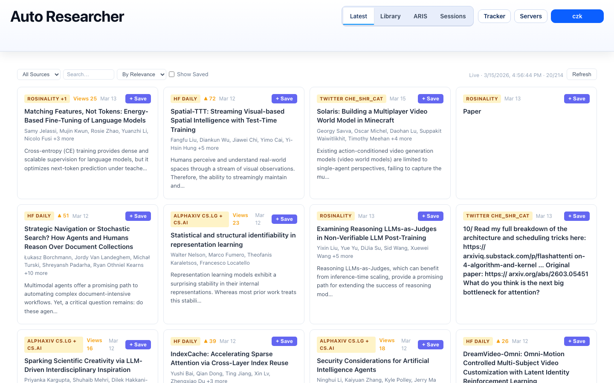
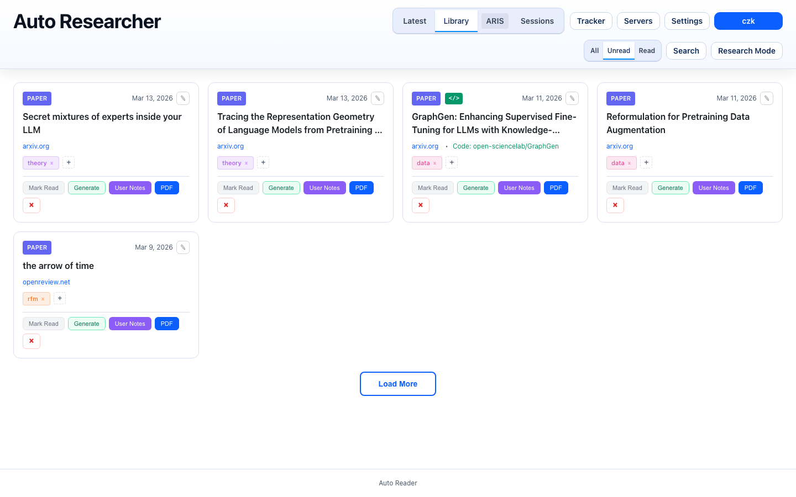
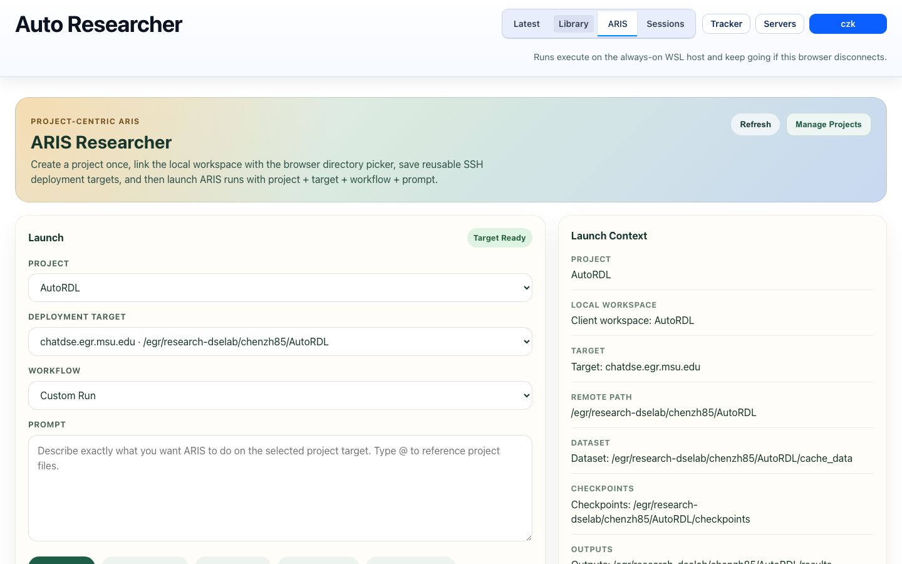
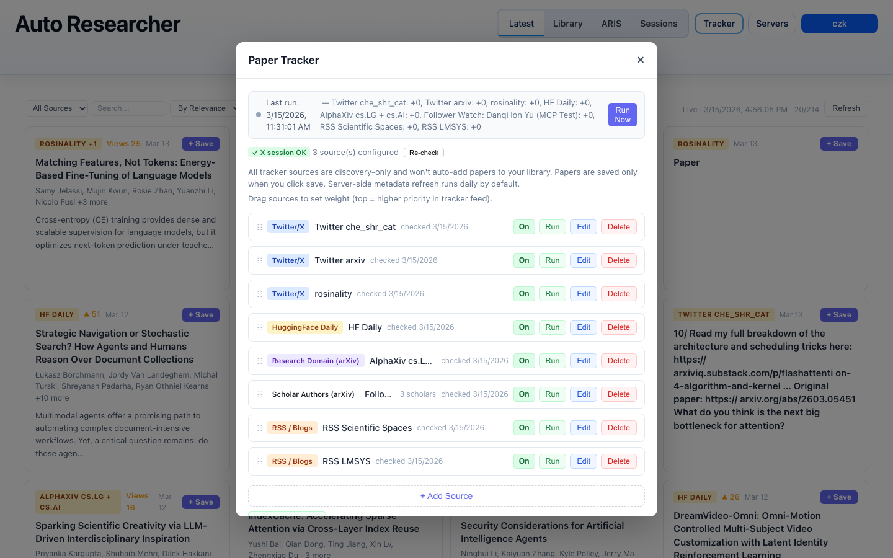

# Amadeus

Your personal AI research assistant that automatically reads, summarizes, organizes, and acts on academic papers.


**[English](#features) | [中文文档](docs/README_CN.md)**

---

## Screenshots

| Latest Feed | Paper Library |
|:---:|:---:|
|  |  |

| ARIS Workspace | Tracker Admin |
|:---:|:---:|
|  |  |

## Features

### Paper Management
- **One-click paper saving** via Chrome extension — supports arXiv, OpenReview, and any PDF URL
- **PDF storage** in S3, MinIO, or Aliyun OSS with signed download links
- **Read tracking** — mark papers as read/unread, view reading history with timestamps
- **Tag system** — auto-suggested and manual tags with color-coded badges
- **Full-text search** across titles, tags, notes, and paper content

### AI-Powered Deep Reading
- **Multi-pass analysis pipeline** generates comprehensive notes:
  - Pass 1: Bird's eye scan (structure, key pages, metadata extraction)
  - Pass 2: Content understanding (methods, results, figure reproduction in ASCII art)
  - Pass 3: Deep analysis (mathematical framework, architecture diagrams, algorithm details)
- **Multiple AI providers**: Gemini CLI, Google Gemini API, Claude Code CLI, Codex CLI
- **Multiple reading modes**: vanilla (English summary), auto_reader (3-pass Chinese), auto_reader_v2 (with rendered SVG diagrams), auto_reader_v3 (implementation-focused)
- **Rendered output** with Mermaid diagrams, KaTeX math, and Markdown

### Paper Tracking
- **Semantic Scholar** — subscribe to author IDs or keyword queries for daily new paper alerts
- **Google Scholar** — parse email alerts via OAuth-linked Gmail to detect new arXiv papers
- **Twitter/X** — monitor researcher profiles for paper mentions (Playwright-based, experimental)
- **RSS feeds** — subscribe to any RSS source
- **Tracker admin UI** — configure sources, intervals, and view the aggregated feed

### ARIS Autonomous Research Workflows
- **Project model** — link a local workspace, define SSH deployment targets with remote paths
- **Run workflows** — launch autonomous research runs on remote compute (literature review, experiment monitoring, paper writing, full pipeline, custom prompts)
- **Run monitoring** — real-time status, log streaming, workspace inspection, follow-up actions
- **Remote Claude Code** — execute Claude Code CLI on registered SSH servers with git worktrees
- **VS Code companion** — in-editor project tree, ARIS run management, and paper library access

### Chrome Extension
- **Auto-detection** of arXiv, OpenReview, Semantic Scholar, and generic PDF pages
- **One-click save** with auto-populated metadata (title, authors, arXiv ID, code URL)
- **Configurable** server URL, analysis provider, tags, and document type

### Export & Integration
- **Obsidian export** — export notes as Markdown files compatible with Obsidian vaults
- **MCP server** — expose the paper library as an MCP tool for Claude Code and other AI agents
- **VS Code extension** — browse papers, launch ARIS runs, and view notes without leaving the editor

### SSH Server Management
- Register remote compute nodes with SSH credentials (password or key-based auth, proxy jump)
- Use as ARIS deployment targets for offloading heavy AI workloads
- WebSocket-based terminal proxy for in-browser SSH access

## Architecture

The install script lets you choose your deployment mode:

- **All-in-one** — backend, frontend, and AI all run on the same machine (local or cloud)
- **Proxy + local device** — a cheap cloud server acts as an HTTPS proxy via [FRP](https://github.com/fatedier/frp), forwarding traffic to your always-on local device that runs all services

```
# Proxy + local device mode
┌──────────┐     ┌──────────────────────┐     ┌─────────────────────────┐
│  Browser │────>│  Cloud Server (proxy) │────>│  Local Device (WSL/PC)  │
│          │     │  nginx + frps         │     │  PM2: API + Frontend    │
└──────────┘     └──────────────────────┘     │  SQLite/Turso, S3       │
                                               └─────────────────────────┘
```

The proxy mode lets heavy AI workloads (Claude Code CLI, Gemini CLI) run on your own hardware with no cloud GPU costs. See [Installation Modes](docs/INSTALLATION_MODES.md) for all options.

## Quick Start

### Prerequisites

- Node.js >= 20.0.0
- npm
- A supported AI CLI (at least one): [Gemini CLI](https://github.com/google-gemini/gemini-cli), [Claude Code](https://docs.anthropic.com/en/docs/claude-code), or [Codex CLI](https://github.com/openai/codex)
- Object storage account (AWS S3, MinIO, or Aliyun OSS) for PDF storage

### 1. Clone the Repository

```bash
git clone https://github.com/CurryTang/Amadeus.git
cd Amadeus
```

### 2. Run the Interactive Installer

The installer walks you through deployment mode selection and generates environment files with all required configuration.

```bash
./scripts/install.sh
```

This generates:
- `backend/.env.generated` — backend configuration (database, storage, auth, AI providers)
- `frontend/.env.generated` — frontend configuration (API URL)
- `deployment.mode.generated` — deployment topology

### 3. Apply and Review Configuration

```bash
cp backend/.env.generated backend/.env
cp frontend/.env.generated frontend/.env
```

Open `backend/.env` and configure these key sections:

**Database** (metadata storage):
```bash
# Local SQLite (simplest, no setup needed)
TURSO_DATABASE_URL=file:./local.db

# Or Turso cloud (hosted libSQL)
# TURSO_DATABASE_URL=libsql://your-db.turso.io
# TURSO_AUTH_TOKEN=your_turso_token
```

**Object Storage** (PDF files):
```bash
OBJECT_STORAGE_PROVIDER=aws-s3    # aws-s3 | minio | aliyun-oss
OBJECT_STORAGE_BUCKET=your-bucket
OBJECT_STORAGE_REGION=us-east-1
OBJECT_STORAGE_ACCESS_KEY_ID=your-key
OBJECT_STORAGE_SECRET_ACCESS_KEY=your-secret
```

For MinIO (self-hosted, free):
```bash
OBJECT_STORAGE_PROVIDER=minio
OBJECT_STORAGE_ENDPOINT=http://127.0.0.1:9000
OBJECT_STORAGE_FORCE_PATH_STYLE=true
```

**Authentication**:
```bash
AUTH_ENABLED=true
ADMIN_TOKEN=your-secret-admin-token
JWT_SECRET=your-random-64-char-hex-string
```

**AI Providers** (at least one):
```bash
GEMINI_API_KEY=your-gemini-key        # For Gemini API provider
# Or install Gemini/Claude/Codex CLI globally — no key needed if CLI is configured
```

See [Configuration Guide](docs/CONFIGURATION.md) for all options.

### 4. Start the Backend

```bash
cd backend
npm install
npm run dev     # Development with hot reload
# npm start     # Production
```

### 5. Start the Frontend

```bash
cd frontend
npm install
npm run dev     # Development at http://localhost:3000
# npm run build && npm start  # Production (standalone)
```

### 6. Install the Chrome Extension

1. Open Chrome and go to `chrome://extensions/`
2. Enable **Developer mode** (top right toggle)
3. Click **Load unpacked** and select the `chrome-extension/` folder
4. Click the extension icon → Settings → set your server URL (e.g. `http://localhost:3000`)
5. Navigate to any arXiv paper and click **Save arXiv PDF**

### 7. (Optional) VS Code Extension

```bash
cd vscode-extension
npm install && npm run compile
```

Then press `F5` in VS Code to launch an Extension Development Host. See [VS Code Companion README](vscode-extension/README.md).

## How It Works

### Paper Processing Pipeline

```
Save (Chrome extension)
  → Queue (processing queue with priority)
    → Pass 1: Bird's eye scan (metadata, structure)
      → Pass 2: Content understanding (methods, results, figures)
        → Pass 3: Deep analysis (math, architecture, algorithms)
          → Store (notes to S3 as Markdown)
            → View (rendered with diagrams + math)
```

### Tracker Pipeline

```
Configure sources (Semantic Scholar / Gmail / Twitter / RSS)
  → Daily crawl (automatic or manual trigger)
    → Deduplicate against existing library
      → Surface new papers in tracker feed
        → One-click save to library
```

### ARIS Research Workflow

```
Define project (link local workspace)
  → Add target (SSH server + remote path)
    → Launch run (workflow + prompt)
      → Agent executes on remote (git worktree isolation)
        → Monitor logs + status in real-time
          → Review outputs, send follow-up instructions
```

## Documentation

- [Configuration Guide](docs/CONFIGURATION.md) — All environment variables and options
- [Installation Modes](docs/INSTALLATION_MODES.md) — Deployment topologies and provider matrix
- [Deployment Guide](docs/DEPLOYMENT.md) — Production deployment steps
- [DO + FRP + Tailscale](docs/DO_FRP_TAILSCALE.md) — Proxy + FRP + VPN setup
- [FRP Setup Guide](docs/FRP_SETUP_GUIDE.md) — Detailed FRP configuration
- [S3 Setup Guide](docs/S3_SETUP_GUIDE.md) — Object storage setup (S3/MinIO/OSS)
- [Tracker Auth Guide](docs/TRACKER_AUTH.md) — Google Scholar and Twitter/X tracker auth
- [VS Code Companion](vscode-extension/README.md) — VS Code extension setup

## Tech Stack

| Layer | Technologies |
|-------|-------------|
| **Frontend** | React 18, Next.js (standalone), React Markdown, KaTeX, Mermaid |
| **Backend** | Node.js, Express, WebSocket (terminal proxy) |
| **Database** | Turso (libSQL) / local SQLite |
| **Storage** | AWS S3 / MinIO / Aliyun OSS |
| **AI** | Claude Code CLI, Gemini CLI, Codex CLI, Google Gemini API |
| **Infra** | PM2, FRP (reverse proxy), nginx |
| **Extension** | Chrome Manifest V3, VS Code Extension API |

## Acknowledgements

- The ARIS (Autonomous Research In Sleep) workflow system is built on top of [Auto-claude-code-research-in-sleep](https://github.com/wanshuiyin/Auto-claude-code-research-in-sleep) by [@wanshuiyin](https://github.com/wanshuiyin), which pioneered the idea of running Claude Code autonomously on research tasks while you sleep.
- [Claude Code](https://docs.anthropic.com/en/docs/claude-code) by Anthropic — agent-based code analysis and autonomous research execution
- [Gemini](https://deepmind.google/technologies/gemini/) by Google — multi-pass paper analysis
- [Mermaid](https://mermaid.js.org/) — diagram rendering in notes
- [KaTeX](https://katex.org/) — math formula rendering

## Contributing

Contributions are welcome! Please feel free to submit a Pull Request.

## License

MIT License — see [LICENSE](LICENSE) for details.
