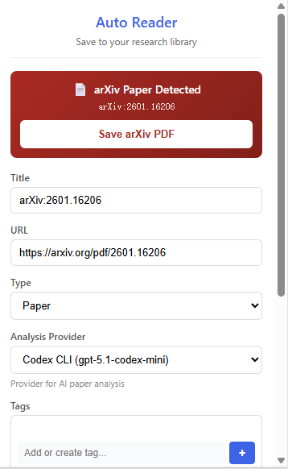

# Auto Researcher

Your personal AI research assistant that automatically reads, summarizes, organizes, and acts on academic papers.


**[English](#english-version) | [中文文档](docs/README_CN.md)**

---

# English Version

## Screenshots

| Web Interface | Chrome Extension |
|:---:|:---:|
|  |  |

## Features

- **One-Click Paper Saving** - Chrome extension saves papers from arXiv, OpenReview, and any PDF
- **AI-Powered Summaries** - Multi-pass deep reading generates comprehensive notes with diagrams and math
- **Code Analysis** - Automatically analyzes associated GitHub repositories
- **Paper Tracker** - Subscribe to authors/keywords; daily crawl from Semantic Scholar and Twitter/X
- **SSH Server Management** - Register remote compute nodes; agent runs offload heavy tasks via SSH
- **ARIS VS Code Companion** - Compact in-editor control surface for launching and monitoring ARIS runs
- **Read Tracking** - Mark papers as read/unread, filter your library
- **Full-Text Search** - Find papers by title, tags, and content

## Architecture

The install script lets you choose your deployment mode. Common options:

- **All-in-one** — backend, frontend, and AI all run on the same machine (local or cloud)
- **Proxy + local device** — a cheap cloud server (e.g. DigitalOcean) acts as an HTTPS proxy via [FRP](https://github.com/fatedier/frp), forwarding traffic to an always-on local device (WSL/home PC) that runs all services

```
# Proxy + local device mode
┌──────────┐     ┌──────────────────────┐     ┌─────────────────────────┐
│  Browser │────▶│  Cloud Server (proxy) │────▶│  Local Device (WSL/PC)  │
│          │     │  nginx + frps         │     │  PM2: API + Frontend    │
└──────────┘     └──────────────────────┘     │  MongoDB, Turso, S3     │
                                               └─────────────────────────┘
```

The proxy mode lets heavy AI workloads (Claude Code CLI, Gemini CLI) run on your own hardware with no cloud GPU costs. See [Installation Modes](docs/INSTALLATION_MODES.md) for all options.

## Quick Start

### 1. Clone the Repository

```bash
git clone https://github.com/CurryTang/auto-researcher.git
cd auto-researcher
```

### 2. Generate Mode-Specific Configs

```bash
./scripts/install.sh
# Generates:
# - backend/.env.generated
# - frontend/.env.generated
# - deployment.mode.generated
# Also lets you choose frontend/backend compile and deploy targets.
```

### 3. Apply Generated Envs

```bash
cp backend/.env.generated backend/.env
cp frontend/.env.generated frontend/.env
```

### 4. Start Backend and Frontend

```bash
cd backend && npm install && npm run dev
cd frontend && npm install && npm run dev
```

### 5. Install Chrome Extension

1. Open Chrome and go to `chrome://extensions/`
2. Enable "Developer mode"
3. Click "Load unpacked" and select the `chrome-extension/` folder

### 6. Run the ARIS VS Code Companion

```bash
cd vscode-extension
npm install
npm run compile
npm test
```

Then launch the extension with an Extension Development Host from VS Code. See [ARIS VS Code Companion](vscode-extension/README.md) for the exact workflow and required ARIS backend endpoints.

## How It Works

### Paper Processing Pipeline

1. **Save** - Chrome extension captures paper metadata and PDF
2. **Queue** - Paper is added to processing queue
3. **Analyze** - AI performs 3-pass deep reading:
   - Pass 1: Bird's eye scan (structure, key pages)
   - Pass 2: Content understanding (methods, results)
   - Pass 3: Deep analysis (math, diagrams)
4. **Store** - Notes saved to object storage (S3/MinIO/OSS)
5. **View** - Rendered notes with Mermaid diagrams and KaTeX math

### Paper Tracker

Subscribe to Semantic Scholar author IDs or keyword queries. The tracker runs daily and surfaces new papers in the feed. Twitter/X profiles can also be monitored (Playwright-based, experimental).

## Documentation

- [Deployment Guide](docs/DEPLOYMENT.md) - How to deploy to production
- [DO + FRP + Tailscale](docs/DO_FRP_TAILSCALE.md) - Proxy + FRP + VPN setup
- [Tracker Authentication Guide](docs/TRACKER_AUTH.md) - Google Scholar and Twitter/X tracker auth setup
- [S3 Setup Guide](docs/S3_SETUP_GUIDE.md) - Object storage setup (S3/MinIO/OSS)
- [Installation Modes](docs/INSTALLATION_MODES.md) - Deployment modes and provider matrix
- [Configuration Guide](docs/CONFIGURATION.md) - All configuration options
- [ARIS VS Code Companion](vscode-extension/README.md) - VS Code companion setup and scope

## ARIS Integration

This repo can act as the paper-library backend for ARIS using our maintained fork at [CurryTang/Auto-claude-code-research-in-sleep](https://github.com/CurryTang/Auto-claude-code-research-in-sleep).

The intended model is:

- keep ARIS in a separate fork or upstream clone
- install that repo into a target project with `scripts/setup-aris-integration.sh`
- expose Auto Researcher as an MCP paper library through `backend/src/mcp/auto-researcher-mcp-server.js`
- let the ARIS `research-lit` workflow query saved documents, notes, tags, reading history, and citations from this system instead of Zotero
- launch ARIS from the new top-level `ARIS` workspace in the web app
- run ARIS canonically on the always-on WSL/local executor host so loops continue after the browser disconnects
- use managed SSH server records as downstream experiment targets while keeping large datasets on remote storage paths

Bootstrap commands:

```bash
./scripts/setup-aris-integration.sh /path/to/project
cd backend && npm install
claude mcp add auto-researcher -s project -- node /absolute/path/to/auto-researcher/backend/src/mcp/auto-researcher-mcp-server.js
```

The maintained integration notes live under `resource/integrations/aris/`.

The web app now includes a dedicated `ARIS` workspace with:

- a freeform launcher input that stays editable even when using presets
- quick actions for literature review, idea discovery, experiments, review loops, paper writing, paper improvement, full pipeline, and experiment monitoring
- a run context panel showing the canonical WSL runner, persistent remote workspace path, remote dataset root, and downstream compute target
- a recent run feed for queued, running, waiting, completed, and failed ARIS runs

Runner requirements:

- the selected WSL runner must be registered in `SSH Server Management`
- the target remote workspace should already contain the project plus `.claude/skills/aris`
- `claude` must be installed on that runner; override the binary with `ARIS_REMOTE_AGENT_BIN` if needed

## Tech Stack

**Frontend:**
- React 18 + Next.js (standalone mode)
- React Markdown + KaTeX + Mermaid
- PM2 on local device, proxied via FRP

**Backend:**
- Node.js + Express
- Turso / local SQLite (documents metadata)
- AWS S3 / MinIO / Aliyun OSS (paper object storage)
- PM2 process manager

**AI:**
- Claude Code CLI (code analysis)
- Google Gemini CLI (paper analysis)

## Configuration

Key environment variables:

```bash
# Documents metadata (local sqlite or Turso cloud)
TURSO_DATABASE_URL=file:./local.db
# TURSO_DATABASE_URL=libsql://your-db.turso.io
TURSO_AUTH_TOKEN=

# Object storage (aws-s3 | minio | aliyun-oss)
OBJECT_STORAGE_PROVIDER=aws-s3
OBJECT_STORAGE_BUCKET=your-bucket
OBJECT_STORAGE_REGION=us-east-1
OBJECT_STORAGE_ACCESS_KEY_ID=your-key
OBJECT_STORAGE_SECRET_ACCESS_KEY=your-secret

# Authentication
ADMIN_TOKEN=your-admin-token  # For write operations

# Remote offload optional
TRACKER_PROXY_HEAVY_OPS=true
TRACKER_PROXY_STRICT=true
TRACKER_EXECUTION_TARGET=client # or backend
TRACKER_STALE_AUTO_RUN=true
TRACKER_STALE_PROXY_AUTO_RUN=true
TRACKER_STALE_RUN_TRIGGER_MS=86400000
TAILSCALE_ENABLED=false
```

See [Configuration Guide](docs/CONFIGURATION.md) for all options.

## Development

```bash
# Backend (with hot reload)
cd backend && npm run dev

# Frontend (with hot reload)
cd frontend && npm run dev
```

## Experimental: X/Twitter Paper Post Extractor (Playwright)

1. Install backend dependencies and Playwright browser:
```bash
cd backend
npm install
npx playwright install chromium
```

2. Create a logged-in X session storage state (recommended for reliable latest timeline):
```bash
cd backend
npm run setup:x-session
# Example output path on WSL/Linux:
# /home/<user>/.playwright/x-session.json
```

Then set in `backend/.env` on the same execution node:
```bash
X_PLAYWRIGHT_STORAGE_STATE_PATH=/absolute/path/to/x-state.json
```

If the backend host is headless (no GUI), generate `x-state.json` on a GUI machine first, then copy it to backend and point `X_PLAYWRIGHT_STORAGE_STATE_PATH` to that copied file.

3. Run extractor with profile links:
```bash
npm run exp:x-papers -- --links "https://x.com/karpathy,https://x.com/ylecun" --out ./x-paper-posts.json
```

Tracker Admin supports Twitter source mode `Playwright (experimental)` with multiple profile links.
By default it runs daily (`crawlIntervalHours=24`), archives newly seen post URLs, and avoids re-processing archived posts on later runs.

## Contributing

Contributions are welcome! Please feel free to submit a Pull Request.

## License

MIT License - see [LICENSE](LICENSE) for details.

## Acknowledgments

- [Gemini](https://deepmind.google/technologies/gemini/) for paper analysis
- [Claude](https://claude.ai/) for agent-based research automation
- [Mermaid](https://mermaid.js.org/) for diagram rendering
- [KaTeX](https://katex.org/) for math rendering
