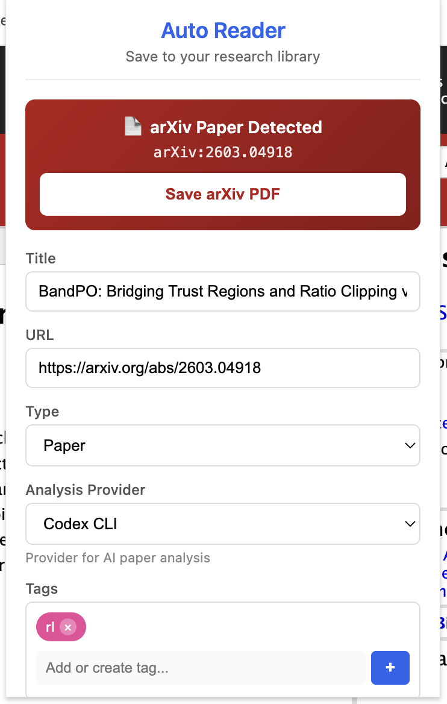

# Amadeus

Your personal AI research assistant that automatically reads, summarizes, organizes, and acts on academic papers.

[](LICENSE)
[](https://nodejs.org)
[](https://currytang.github.io/Amadeus/)

**[Documentation & Guides](https://currytang.github.io/Amadeus/) | [English](#features) | [中文文档](docs/README_CN.md)**

---

## Screenshots

| Latest Feed | Paper Library |
|:---:|:---:|
|  |  |

| ARIS Workspace | Tracker Admin |
|:---:|:---:|
|  |  |

| Chrome Extension | |
|:---:|:---:|
|  | |

## Features

### Paper Management
- **One-click paper saving** via Chrome extension — supports arXiv, OpenReview, and any PDF URL
- **PDF storage** in S3, MinIO, or Aliyun OSS with signed download links
- **Read tracking** — mark papers as read/unread, view reading history with timestamps
- **Tag system** — auto-suggested and manual tags with color-coded badges
- **Full-text search** across titles, tags, notes, and paper content

### AI-Powered Deep Reading
- **Multi-pass analysis pipeline** generates comprehensive notes:
  - Pass 1: Bird's eye scan (structure, key pages, metadata extraction)
  - Pass 2: Content understanding (methods, results, figure reproduction in ASCII art)
  - Pass 3: Deep analysis (mathematical framework, architecture diagrams, algorithm details)
- **Multiple AI providers**: Gemini CLI, Google Gemini API, Claude Code CLI, Codex CLI
- **Multiple reading modes**: vanilla (English summary), auto_reader (3-pass Chinese), auto_reader_v2 (with rendered SVG diagrams), auto_reader_v3 (implementation-focused)
- **Rendered output** with Mermaid diagrams, KaTeX math, and Markdown

### Paper Tracking
- **Semantic Scholar** — subscribe to author IDs or keyword queries for daily new paper alerts
- **Google Scholar** — parse email alerts via OAuth-linked Gmail to detect new arXiv papers
- **Twitter/X** — monitor researcher profiles for paper mentions (Playwright-based, experimental)
- **RSS feeds** — subscribe to any RSS source
- **Tracker admin UI** — configure sources, intervals, and view the aggregated feed

### ARIS Autonomous Research Workflows
- **Project model** — link a local workspace, define SSH deployment targets with remote paths
- **Run workflows** — launch autonomous research runs on remote compute (literature review, experiment monitoring, paper writing, full pipeline, custom prompts)
- **Run monitoring** — real-time status, log streaming, workspace inspection, follow-up actions
- **Remote Claude Code** — execute Claude Code CLI on registered SSH servers with git worktrees
- **VS Code companion** — in-editor project tree, ARIS run management, and paper library access

### Chrome Extension
- **Auto-detection** of arXiv, OpenReview, Semantic Scholar, and generic PDF pages
- **One-click save** with auto-populated metadata (title, authors, arXiv ID, code URL)
- **Configurable** server URL, analysis provider, tags, and document type

### Export & Integration
- **Obsidian export** — export AI-generated notes as Markdown files directly into your Obsidian vault. Requires [Obsidian CLI](https://help.obsidian.md/cli) (v1.8+) — install it from Obsidian Settings > General > "Install CLI". The CLI is used for vault discovery and file indexing; notes are written with YAML frontmatter (title, source, doc_id, URL) for full Obsidian compatibility.
- **MCP server** — expose the paper library as an MCP tool for Claude Code and other AI agents
- **VS Code extension** — browse papers, launch ARIS runs, and view notes without leaving the editor

### SSH Server Management
- Register remote compute nodes with SSH credentials (password or key-based auth, proxy jump)
- Use as ARIS deployment targets for offloading heavy AI workloads
- WebSocket-based terminal proxy for in-browser SSH access

## Architecture

The install script lets you choose your deployment mode:

- **All-in-one** — backend, frontend, and AI all run on the same machine (local or cloud)
- **Proxy + local device** — a cheap cloud server acts as an HTTPS proxy via [FRP](https://github.com/fatedier/frp), forwarding traffic to your always-on local device that runs all services

```
# Proxy + local device mode
┌──────────┐     ┌──────────────────────┐     ┌─────────────────────────┐
│  Browser │────>│  Cloud Server (proxy) │────>│  Local Device (WSL/PC)  │
│          │     │  nginx + frps         │     │  PM2: API + Frontend    │
└──────────┘     └──────────────────────┘     │  SQLite/Turso, S3       │
                                               └─────────────────────────┘
```

The proxy mode lets heavy AI workloads (Claude Code CLI, Gemini CLI) run on your own hardware with no cloud GPU costs. See [Installation Modes](docs/INSTALLATION_MODES.md) for all options.

## Quick Start (Minimal Local Setup)

The fastest way to get running — **SQLite + MinIO**, no cloud accounts needed.

### Prerequisites

- Node.js >= 20.0.0, npm
- [MinIO](https://min.io/docs/minio/macos/index.html) for local PDF storage (or any S3-compatible service)
- (Optional) [Obsidian](https://obsidian.md) + [Obsidian CLI](https://help.obsidian.md/cli) for exporting notes to your vault
- (Optional) A supported AI CLI for paper analysis: [Codex CLI](https://github.com/openai/codex) (default), [Gemini CLI](https://github.com/google-gemini/gemini-cli), or [Claude Code](https://docs.anthropic.com/en/docs/claude-code)

### 1. Clone and Install

```bash
git clone https://github.com/CurryTang/Amadeus.git
cd Amadeus

cd backend && npm install && cd ..
cd frontend && npm install && cd ..
```

### 2. Start MinIO

```bash
# Install MinIO (macOS)
brew install minio/stable/minio minio/stable/mc

# Start MinIO server
mkdir -p ~/minio-data
MINIO_ROOT_USER=minioadmin MINIO_ROOT_PASSWORD=minioadmin \
  minio server ~/minio-data --address :9000 --console-address :9001 &

# Create the storage bucket
mc alias set local http://127.0.0.1:9000 minioadmin minioadmin
mc mb local/auto-reader-documents
mc anonymous set download local/auto-reader-documents
```

### 3. Configure

**Option A: Interactive installer** (recommended for first-time setup):

```bash
./scripts/install.sh          # Walks through all options, creates user accounts
cp backend/.env.generated backend/.env
cp frontend/.env.generated frontend/.env
```

**Option B: Manual minimal `.env`**:

```bash
cat > backend/.env << 'EOF'
PORT=3000
NODE_ENV=development
CORS_ORIGIN=*
AUTH_ENABLED=true
ADMIN_TOKEN=change-me-to-a-random-string
JWT_SECRET=change-me-to-a-64-char-random-string
CZK_PASSWORD=your-login-password
TURSO_DATABASE_URL=file:./local.db
OBJECT_STORAGE_PROVIDER=minio
OBJECT_STORAGE_BUCKET=auto-reader-documents
OBJECT_STORAGE_REGION=us-east-1
OBJECT_STORAGE_ACCESS_KEY_ID=minioadmin
OBJECT_STORAGE_SECRET_ACCESS_KEY=minioadmin
OBJECT_STORAGE_ENDPOINT=http://127.0.0.1:9000
OBJECT_STORAGE_FORCE_PATH_STYLE=true
OBJECT_STORAGE_PUBLIC_BASE_URL=http://127.0.0.1:9000/auto-reader-documents
TRACKER_ENABLED=true
TRACKER_EXECUTION_TARGET=backend
READER_ENABLED=true
READER_DEFAULT_PROVIDER=gemini-cli
READER_CONCURRENCY=1
EOF

cat > frontend/.env << 'EOF'
NEXT_PUBLIC_DEV_API_URL=/api
NEXT_DEV_BACKEND_URL=http://127.0.0.1:3000
NEXT_PUBLIC_API_URL=http://127.0.0.1:3000/api
EOF
```

### 4. Start

```bash
# Terminal 1: Backend
cd backend && node src/index.js

# Terminal 2: Frontend
cd frontend && npx next dev
```

Open http://localhost:3000 and log in with username `czk` and the password you set.

### 5. (Optional) Chrome Extension

1. Open `chrome://extensions/` → enable **Developer mode**
2. Click **Load unpacked** → select the `chrome-extension/` folder
3. Click the extension icon → Settings → set server URL to `http://localhost:3000`
4. Navigate to any arXiv paper and click **Save arXiv PDF**

---

## Remote Server Deployment

For always-on access, deploy the backend on a cloud server (or any always-on device) and optionally use a reverse proxy.

### All-in-one (single server)

Run both backend and frontend on the same server. Use the interactive installer and choose "All local":

```bash
./scripts/install.sh    # Select mode 2: "All local"
```

Set `NEXT_PUBLIC_API_URL=https://your-domain/api` in `frontend/.env` and place nginx in front for HTTPS.

### Proxy + Local Device (FRP)

A cheap cloud VPS acts as an HTTPS reverse proxy, forwarding traffic via [FRP](https://github.com/fatedier/frp) to your always-on local device (WSL, desktop, NAS) that runs everything:

```
┌──────────┐     ┌──────────────────────┐     ┌─────────────────────────┐
│  Browser │────>│  Cloud VPS (proxy)    │────>│  Local Device (WSL/PC)  │
│          │     │  nginx + frps         │     │  PM2: API + Frontend    │
└──────────┘     └──────────────────────┘     │  SQLite, MinIO/S3       │
                                               └─────────────────────────┘
```

This lets heavy AI workloads (Claude Code CLI, Gemini CLI) run on your own hardware with no cloud GPU costs. See [FRP Setup Guide](docs/FRP_SETUP_GUIDE.md) for configuration.

---

## Full Setup (Interactive Installer)

For advanced setups (Turso cloud DB, AWS S3, FRP proxy, ARIS integration), use the full interactive installer:

```bash
./scripts/install.sh
```

It walks you through:
- Deployment mode (all-local, proxy+FRP, cloud)
- Storage provider (MinIO, AWS S3, Aliyun OSS)
- Database (local SQLite or Turso cloud)
- User account creation (passwords set interactively)
- Networking (direct, FRP, Tailscale)
- AI provider selection
- ARIS research workflow integration

See [Configuration Guide](docs/CONFIGURATION.md) and [Installation Modes](docs/INSTALLATION_MODES.md) for all options.

## How It Works

### Paper Processing Pipeline

```
Save (Chrome extension)
  → Queue (processing queue with priority)
    → Pass 1: Bird's eye scan (metadata, structure)
      → Pass 2: Content understanding (methods, results, figures)
        → Pass 3: Deep analysis (math, architecture, algorithms)
          → Store (notes to S3 as Markdown)
            → View (rendered with diagrams + math)
```

### Tracker Pipeline

```
Configure sources (Semantic Scholar / Gmail / Twitter / RSS)
  → Daily crawl (automatic or manual trigger)
    → Deduplicate against existing library
      → Surface new papers in tracker feed
        → One-click save to library
```

### ARIS Research Workflow

```
Define project (link local workspace)
  → Add target (SSH server + remote path)
    → Launch run (workflow + prompt)
      → Agent executes on remote (git worktree isolation)
        → Monitor logs + status in real-time
          → Review outputs, send follow-up instructions
```

## Documentation

- [Configuration Guide](docs/CONFIGURATION.md) — All environment variables and options
- [Installation Modes](docs/INSTALLATION_MODES.md) — Deployment topologies and provider matrix
- [Deployment Guide](docs/DEPLOYMENT.md) — Production deployment steps
- [DO + FRP + Tailscale](docs/DO_FRP_TAILSCALE.md) — Proxy + FRP + VPN setup
- [FRP Setup Guide](docs/FRP_SETUP_GUIDE.md) — Detailed FRP configuration
- [S3 Setup Guide](docs/S3_SETUP_GUIDE.md) — Object storage setup (S3/MinIO/OSS)
- [Tracker Auth Guide](docs/TRACKER_AUTH.md) — Google Scholar and Twitter/X tracker auth
- [VS Code Companion](vscode-extension/README.md) — VS Code extension setup

## Tech Stack

| Layer | Technologies |
|-------|-------------|
| **Frontend** | React 18, Next.js (standalone), React Markdown, KaTeX, Mermaid |
| **Backend** | Node.js, Express, WebSocket (terminal proxy) |
| **Database** | Turso (libSQL) / local SQLite |
| **Storage** | AWS S3 / MinIO / Aliyun OSS |
| **AI** | Claude Code CLI, Gemini CLI, Codex CLI, Google Gemini API |
| **Infra** | PM2, FRP (reverse proxy), nginx |
| **Extension** | Chrome Manifest V3, VS Code Extension API |

## Acknowledgements

- The ARIS (Autonomous Research In Sleep) workflow system is built on top of [Auto-claude-code-research-in-sleep](https://github.com/wanshuiyin/Auto-claude-code-research-in-sleep) by [@wanshuiyin](https://github.com/wanshuiyin), which pioneered the idea of running Claude Code autonomously on research tasks while you sleep.
- [Claude Code](https://docs.anthropic.com/en/docs/claude-code) by Anthropic — agent-based code analysis and autonomous research execution
- [Gemini](https://deepmind.google/technologies/gemini/) by Google — multi-pass paper analysis
- [Mermaid](https://mermaid.js.org/) — diagram rendering in notes
- [KaTeX](https://katex.org/) — math formula rendering

## Contributing

Contributions are welcome! Please feel free to submit a Pull Request.

## License

MIT License — see [LICENSE](LICENSE) for details.
