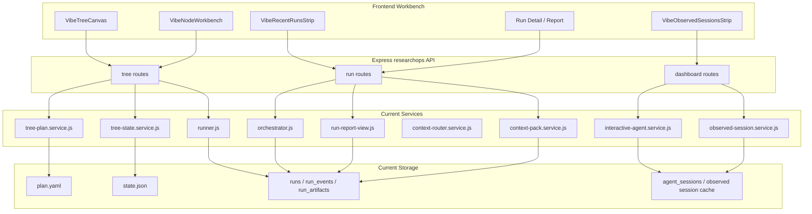

# 02. 系统架构设计

## 2.1 当前架构

当前仓库的真实中心不是全新的 control plane，而是现有 `researchops` 体系：

- 前端：tree-centered execution workbench
- API：Express `researchops` 路由
- 计划与状态：`plan.yaml` + `state.json`
- 执行：`runner.js` + `orchestrator.js`
- 运行数据：`runs` / `run_events` / `run_artifacts`
- 会话：`AgentSession` + `ObservedSession`
- 证据：`RunReport` + deliverable artifacts

当前主数据流：

1. 前端读取 tree plan / tree state。
2. 用户选中 `TreeNode`。
3. 通过 `run-step`、`run-all` 或 `runs/enqueue-v2` 发起执行。
4. 后端创建 `Run`，调度 runner / orchestrator。
5. 系统写入 run events、artifacts、report。
6. tree state、recent runs、observed sessions、run detail 再回到前端。

## 2.2 当前一等公民

当前一等公民应按实现定义，而不是按理想模型定义：

- `TreeNode`
- `TreeState`
- `Run`
- `AgentSession`
- `ObservedSession`
- `KnowledgeContextPack`
- `RoutedRunContext`
- `RunArtifact`
- `RunReport`

设计语义上仍可保留：

- `PlanNode`
- `Attempt`
- 广义 `Session`

但它们在 v0 必须映射到上面的真实对象，而不能替代当前实现边界。

## 2.3 当前系统分层

## 2.4 当前控制面与执行面

当前系统已经存在“轻控制面 + 执行面”的雏形，但边界还没有完全抽象成独立内核。

当前控制面主要负责：

- tree plan / state 读写
- run enqueue / cancel / retry
- context pack 组装
- observed session materialization
- run report 汇总

当前执行面主要负责：

- 实际运行任务
- 采集 stdout / stderr / metrics / artifacts
- 把执行结果回写到 run store

当前不应写成“已实现 event-sourced kernel + projection service + review service”，因为代码里并没有这套独立基础设施。

## 2.5 当前 review 与 evidence 架构

当前系统的 evidence 链是 run-centered：

- `Run`
- `RunArtifact`
- `RunReport`
- deliverable artifacts

当前 review 关注的是：

- 这次 run 到底产出了什么
- output contract / checks 是否满足
- 是否需要人工 approve
- 是否需要 follow-up node

当前不是 bundle-first review queue 架构。

## 2.6 当前 context 架构

当前 `ContextPack` 不是单一对象，而是两层组合：

- `KnowledgeContextPack`
  - groups
  - documents
  - assets
- `RoutedRunContext`
  - selected items
  - role budgets
  - runner / coder / analyst / writer slices

因此本章和后续章节都应把它描述为：

**run-oriented, node-informed context**

而不是严格 node-bound immutable pack。

## 2.7 当前前端架构

当前前端应被定义为：

**tree-centered execution workbench**

主要职责：

- 在 tree 上导航
- 查看选中 node 的工作面板
- 发起 run-step / run-all / clarify
- 查看 recent runs / observed sessions
- 查看 run report / artifacts

当前前端不是完整的 node-centered domain console，也不是 bundle review console。

## 2.8 目标架构

上面的当前架构描述优先于任何未来设计。  
但目标态仍然可以保留，作为后续演进方向：

- 更统一的语义层：`PlanNode`、`Attempt`、广义 `Session`
- 更强的后端真相源和 typed domain service
- 更清晰的 projection / stream 层
- 更标准化的 compare、review、promotion 流程
- 更强的环境抽象和 runtime isolation

这些内容必须写成 target architecture，而不是当前事实。

## 2.9 当前到目标的迁移原则

迁移顺序应是：

1. 先承认并整理现有 `TreeNode / Run / Session / Context / RunReport` 架构。
2. 再在文档语义层引入 `Attempt` 等抽象。
3. 最后逐步收敛到统一状态内核和更强的投影层。

不能跳过现状，直接把未来接口和未来对象当成当前仓库的真实边界。
