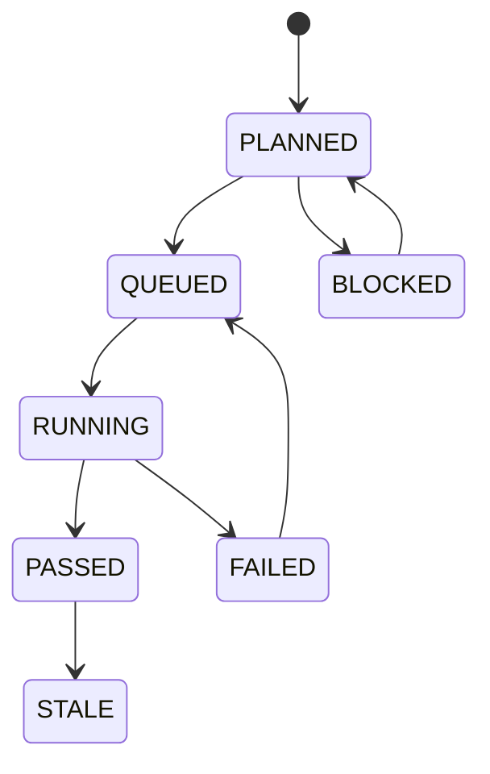
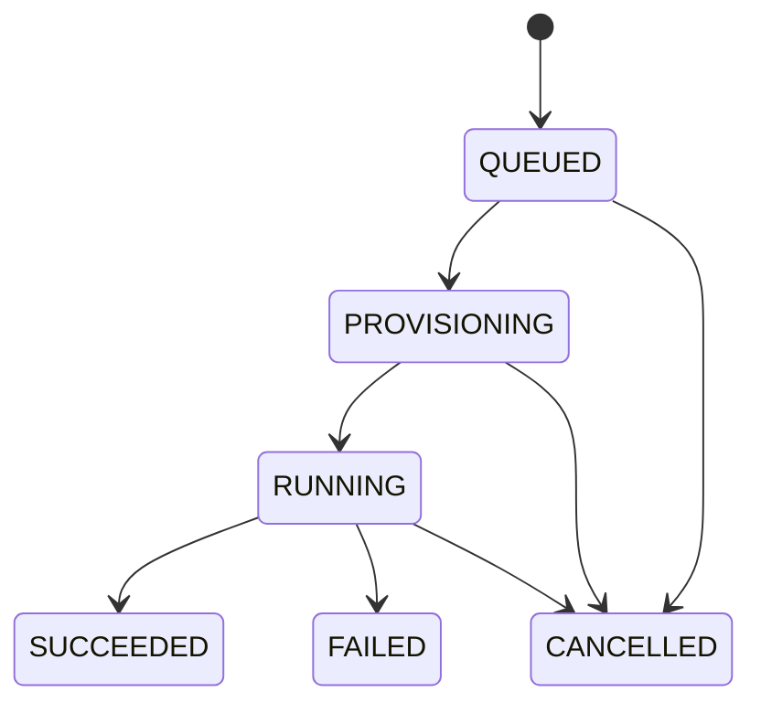
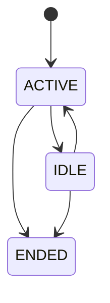

# 03. 数据状态模型与状态机

## 3.1 当前核心对象

| 对象 | 当前实现角色 |
|---|---|
| `TreeNode` | tree/workbench 上的真实节点 |
| `Attempt` | 语义层概念，当前实现里约等于 `Run` |
| `Run` | 当前执行、调度、取消、报告的中心对象 |
| `AgentSession` | 系统内部交互式会话 |
| `ObservedSession` | 外部 agent session 的观测/映射对象 |
| `TreeState` | node 状态、queue、search 的主载体 |
| `RunArtifact` | run 输出 |
| `RunReport` | 当前 evidence / review 主载体 |
| `KnowledgeContextPack` | 知识型上下文 |
| `RoutedRunContext` | 面向本次 run 的上下文切片 |

本章的基本结论：

1. 文档里可继续使用 `PlanNode` 术语，但当前实现对象必须写成 `TreeNode`。
2. `Attempt` 保留在语义层，v0 中 `Attempt ≈ Run`。
3. node 状态主要来自 `TreeState`，不是 node 本体三层状态。
4. review/evidence 当前以 `RunReport + deliverable artifacts` 为主。
5. session 当前必须拆成 `AgentSession` 和 `ObservedSession`。

## 3.2 `TreeNode` / `PlanNode`

### 语义层

文档可以继续把 graph 上的工作单元称为 `PlanNode`。

### 当前实现层

当前真实对象是 `TreeNode`，它不是纯计划对象，而是混合节点：

- 计划信息
- 执行入口
- 证据依赖
- 资源提示
- UI 元数据

### 当前典型字段

```ts
type TreeNode = {
  id: string;
  parent?: string | null;
  title: string;
  kind?: string;
  assumption?: string;
  target?: string;
  commands?: string[];
  checks?: string[];
  evidenceDeps?: string[];
  resources?: Record<string, unknown>;
  git?: Record<string, unknown>;
  ui?: Record<string, unknown>;
  tags?: string[];
  activeChild?: string | null;
  search?: Record<string, unknown>;
};
```

### 重要说明

- `search`、`observed_agent` 等特殊节点必须视为一等公民。
- 当前 node 状态来自 `treeState.nodes[nodeId]`。
- 不应在当前模型中强写 `planStatus / execStatus / reviewStatus` 为 node 本体字段。

## 3.3 `TreeState`

`TreeState` 是当前 tree 执行态的主要载体。

```ts
type TreeNodeStateStatus =
  | "PLANNED"
  | "QUEUED"
  | "RUNNING"
  | "PASSED"
  | "FAILED"
  | "BLOCKED"
  | "STALE";

type TreeNodeState = {
  status: TreeNodeStateStatus;
  lastRunId?: string;
  manualApproved?: boolean;
  search?: Record<string, unknown>;
  updatedAt?: string;
};

type TreeState = {
  nodes: Record<string, TreeNodeState>;
  runs?: Record<string, unknown>;
  queue?: unknown[];
  search?: Record<string, unknown>;
  updatedAt?: string;
};
```

当前应把它视为：

- node execution status 的主要来源
- queue / search 状态的主要来源
- 与 `plan.yaml` 配套的运行时状态文件

## 3.4 `Attempt` 与 `Run`

### 约定

这一点已经定案：

- `Attempt` 是语义层对象
- `Run` 是当前实现层对象
- v0 中 `Attempt ≈ Run`

### 当前 `Run`

```ts
type RunStatus =
  | "QUEUED"
  | "PROVISIONING"
  | "RUNNING"
  | "SUCCEEDED"
  | "FAILED"
  | "CANCELLED";

type Run = {
  id: string;
  projectId: string;
  runType: string;
  provider?: string;
  status: RunStatus;
  mode?: string;
  workflow?: string;
  metadata?: {
    treeNodeId?: string;
    [key: string]: unknown;
  };
  budgets?: Record<string, unknown>;
  outputContract?: Record<string, unknown>;
  createdAt: string;
  startedAt?: string;
  endedAt?: string;
  updatedAt?: string;
};
```

### 当前关系

- 一个 node 可以关联多个 runs
- 当前主要通过 `Run.metadata.treeNodeId` 和 `TreeState.lastRunId` 形成关联
- 当前不需要在实现层再人为拆出独立 `Attempt` 表

## 3.5 `AgentSession` 与 `ObservedSession`

### `AgentSession`

系统内部创建和维护的会话。

```ts
type AgentSessionStatus = "ACTIVE" | "IDLE" | "ENDED";

type AgentSession = {
  id: string;
  projectId: string;
  provider: string;
  status: AgentSessionStatus;
  serverId?: string;
  activeRunId?: string;
  lastRunId?: string;
  lastRunStatus?: string;
  lastMessage?: string;
  metadata?: Record<string, unknown>;
};
```

### `ObservedSession`

来自外部 session 文件或外部 agent 活动的观测对象。

```ts
type ObservedSession = {
  id: string;
  provider: string;
  sessionFile?: string;
  cwd?: string;
  gitRoot?: string;
  classification?: string;
  latestProgressDigest?: string;
  updatedAt?: string;
};
```

### 当前规则

- 不强行要求所有 session attach 到 node
- node/run/session 当前以弱关联为主
- `ObservedSession` 可以 materialize 成 `observed_agent` node

## 3.6 `KnowledgeContextPack` 与 `RoutedRunContext`

### `KnowledgeContextPack`

```ts
type KnowledgeContextPack = {
  id: string;
  projectId: string;
  groups: unknown[];
  documents: unknown[];
  assets: unknown[];
  markdownPath?: string;
  jsonPath?: string;
  generatedAt?: string;
};
```

### `RoutedRunContext`

```ts
type RoutedRunContext = {
  runId: string;
  selectedItems: unknown[];
  roleBudgets?: Record<string, number>;
  contextForRunner?: string;
  contextForCoder?: string;
  contextForAnalyst?: string;
  contextForWriter?: string;
  generatedAt?: string;
};
```

### 当前结论

- `ContextPack` 当前不是严格 node-bound
- 当前应该描述为 `run-oriented, node-informed`
- richer 的 paper cards / repo focus files / open questions 可以保留为未来增强项

## 3.7 `RunArtifact` 与 `RunReport`

### `RunArtifact`

```ts
type RunArtifact = {
  id: string;
  runId: string;
  type: string;
  title?: string;
  uri?: string;
  metadata?: Record<string, unknown>;
  createdAt?: string;
};
```

### `RunReport`

```ts
type RunReport = {
  runId: string;
  summary?: string;
  steps?: unknown[];
  artifacts?: RunArtifact[];
  checks?: unknown[];
  outputContractWarnings?: string[];
  deliverables?: unknown[];
  generatedAt?: string;
};
```

### 当前 review/evidence 规则

- 当前 review 主体是 `RunReport + deliverable artifacts`
- 当前没有必要引入 `DeliverableBundle` 作为现状主对象
- `manualApproved` 之类的 gate 写在 tree state / node workflow 即可

## 3.8 当前状态机

### `TreeNodeState`



### `Run`



### `AgentSession`



## 3.9 当前不变量

1. `Run` 必须能够关联回 `projectId`。
2. tree node 与 run 的主关联当前通过 metadata / tree state 表达。
3. `ObservedSession` 必须允许独立存在，不依赖 attach 协议。
4. `Run.succeeded` 不等于 node 已完成。
5. `RunReport` 必须可追溯到单个 `Run`。

## 3.10 目标态保留

未来仍然可以演进到更强语义层：

- `PlanNode`
- `Attempt`
- 广义 `Session`
- 更统一的状态真相源
- 更标准化的 review / compare / promotion

但这些必须明确写成 target model，而不是当前仓库已落地对象。
