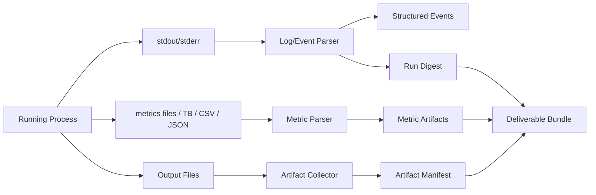

# 04. Environment、执行环境与沙盒设计

## 4.1 目标

执行环境的职责不是“帮 agent 跑命令”，而是：

1. 把科研 workload 放进可控、可观测、可结构化的执行容器中
2. 降低 agent 与传统 terminal 交互时的脆弱性
3. 自动收集日志、指标、artifact 和 deliverable
4. 为本地工具、远程 runner 和人类交互提供统一执行模型

## 4.2 为什么不能直接以 terminal 作为主接口

terminal 的主要问题：
- 语义太弱
- 容易因为 shell 细节出错
- stdout 太长，agent 难以抓重点
- 缺乏稳定对象边界
- 不利于前端和 review

所以建议：
- shell 存在，但仅作为低权限 escape hatch
- 主执行接口是结构化 `RunSpec + ContextPack + WorkspaceSnapshot`

## 4.3 Runtime Class 设计

### 4.3.1 `wasm-lite`
用途：
- 小插件
- verifier
- reward function
- parser
- policy checker
- user simulator / benchmark task logic

特点：
- 启动快
- 能力受限
- 容易审计

### 4.3.2 `container-fast`
默认科研工作负载：
- Python repo setup
- 数据处理
- 模型训练
- 指标计算
- 分析脚本

适合：
- 常规远程 runner
- 内部研发环境
- 绝大多数 run

### 4.3.3 `container-guarded`
在 `container-fast` 之上附加更强约束：
- 更严格的文件系统挂载
- 更严格的网络策略
- 更严格的系统调用限制

适合：
- 中风险 workload
- 多用户内部环境

### 4.3.4 `microvm-strong`
高隔离环境：
- 不可信用户代码
- 隐藏评测
- 高风险 benchmark 任务

适合：
- 强安全边界
- 需要和公开 runner 分离的工作负载

## 4.4 Session Plane：Jupyter / REPL 的位置

Jupyter / REPL 不是 sandbox 的替代，而是 **交互形态**：

- 由 container 或 microVM 承载
- 前端和 agent 通过结构化协议与其通信
- 主要用于交互式分析、notebook 风格实验、快速调试

结论：
- REPL 很适合人机协作
- REPL 不是安全边界
- REPL 也不应成为系统唯一执行接口

## 4.5 Workspace 设计

### 4.5.1 Workspace 类型
- `canonical project workspace`
- `node branch workspace`
- `session workspace`
- `ephemeral run workspace`

### 4.5.2 推荐规则
1. `PlanNode` 可以绑定一个默认 workspaceRef
2. `Session` attach 到 node 后，默认在该 node 的 branch workspace 上工作
3. 发起 run 时，从 session / node workspace 生成 `WorkspaceSnapshot`
4. run 在 snapshot 上执行，而不是直接使用活着的 workspace

### 4.5.3 好处
- 可复现
- 可回滚
- 本地和远程容易对齐
- review 更清楚“结果来自哪个代码状态”

## 4.6 Snapshot 设计

### 4.6.1 WorkspaceSnapshot
建议记录：
- git commit
- uncommitted diff summary
- file manifest
- 关键配置文件 hash
- 关联 node / attempt

### 4.6.2 EnvSnapshot
建议记录：
- runtime class
- image ref
- lockfile
- 关键系统依赖摘要
- CUDA / driver 概况（如有）

### 4.6.3 Snapshot 规则
- 每次 attempt 固定绑定一个 workspace snapshot
- `ContextPack` 与 attempt 也要固定绑定版本
- review 时必须能反查到 snapshot

## 4.7 `RunSpec` / `JobSpec`

### 4.7.1 为什么需要这个对象
这是 environment、agent、前端和 runner 的契约。

### 4.7.2 示例结构

```ts
type JobSpec = {
  backend: "local" | "container" | "k8s" | "slurm";
  runtimeClass: "container-fast" | "container-guarded" | "microvm-strong";
  entrypoint: string[];
  env: Record<string, string>;
  mounts: Array<{ source: string; target: string; readOnly?: boolean }>;
  resources: {
    cpu?: number;
    gpu?: number;
    ramGb?: number;
    timeoutMin?: number;
  };
  outputContract: {
    requiredArtifacts: Array<"metrics" | "table" | "figure" | "checkpoint" | "patch" | "note">;
    metricKeys?: string[];
  };
};
```

## 4.8 日志与指标管线



### 4.8.1 事件类型建议
- `PhaseChanged`
- `StdoutChunk`
- `ErrorSignatureDetected`
- `WarningSignatureDetected`
- `StackTraceExtracted`
- `MetricUpdated`
- `CheckpointSaved`
- `ArtifactDiscovered`
- `ResourceUsageSample`

### 4.8.2 为什么要做事件化
让 agent 和人能通过 API 读：
- 前 3 个致命错误
- 最近一次 metric 改善
- 资源 usage 异常
- 输出了哪些 deliverable

而不是读取一大段原始文本。

## 4.9 Artifact Collectors

每个 run 完成后，环境应尝试自动收集：

- patch diff
- config copy
- metrics summary
- best checkpoint
- result table
- figure
- log digest
- brief note / claim template

### 规则
collector 结果不应该直接决定 run 成败；  
它们应该变成 artifact，再由 bundle builder 选择打包。

## 4.10 Deliverable Bundle 生成

### 结构
1. 目标与假设
2. 使用的 snapshot 和 context
3. 关键运行摘要
4. metrics summary
5. 主要 artifacts
6. claim candidates
7. open questions
8. 推荐 review 动作

### 价值
- reviewer 看结构化 `RunReport + artifacts`，不直接啃原始 run 日志
- agent 也可以通过 `RunReport` 和 deliverable artifacts 快速继续下一步
- 支持 benchmark 和训练数据导出

## 4.11 本地工具接入：Session Bridge

### 目标
让 Claude Code / Codex 这类本地工具不用理解整个系统，只需要理解很薄的一层 API。

### 最小能力
- 读取当前 node / run 关联上下文
- 获取 context pack
- 同步 workspace snapshot
- 上报 note
- 发起 run
- 读取 run digest / report
- 提交 local snapshot run

### 形态
建议本地 daemon：
- localhost HTTP
- 或 Unix domain socket
- Rust 编写，负责认证、缓存和事件上报

## 4.12 典型流程：本地 Claude Code + 远程 runner 协同

1. 本地启动 Claude Code session
2. 读取当前 tree node 关联信息或 observed session materialization
3. 拉取 `ContextPack`
4. 修改文件并在本地生成 snapshot
5. 调用当前真实的 tree/run API 发起执行，例如 `POST /projects/{projectId}/tree/nodes/{nodeId}/run-step` 或 `POST /runs/enqueue-v2`
6. 远程 runner 在固定 snapshot 上执行
7. 本地 session 通过 `GET /runs/{runId}/report`、`GET /runs/{runId}/artifacts` 跟踪结果
8. run 结束后，系统生成 `RunReport` 和 deliverable artifacts
9. 本地 session 读取 report / artifacts，补写说明或创建 child node

## 4.13 错误恢复与重试

### run 级重试
- 允许从同一 node 重试
- 必须产生新的 attempt id
- 不覆盖旧结果

### session 级恢复
- session 掉线后可恢复
- 恢复后需显示“最后已知 snapshot”和“最后一次关联 attempt”

### snapshot 级回滚
- node 可切换当前工作 snapshot
- review 通过的 snapshot 可标记为 stable

## 4.14 最小可行实现建议

### v0 先做：
- container-fast
- Jupyter / REPL 可选
- workspace snapshot
- env snapshot
- log parser 最小版
- metrics collector 最小版
- `RunReport + deliverable artifacts` 最小版

### 暂缓：
- 多 backend 调度复杂性
- 复杂多租户隔离
- 超强 parser 智能化
- 自动 claim 评审全自动化
