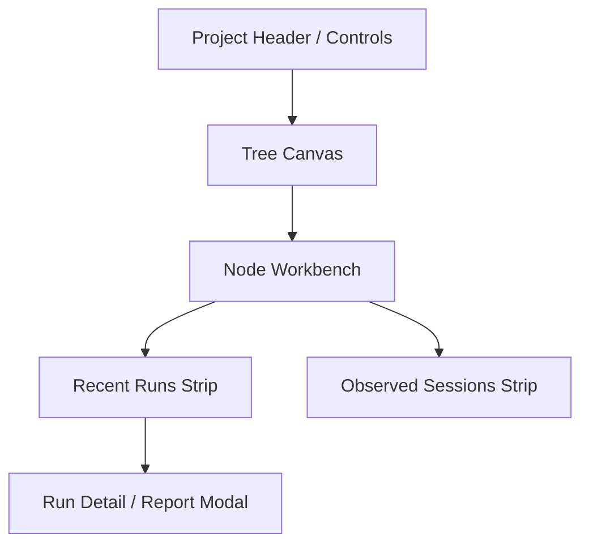

# 06. 前端与交互设计规范

## 6.1 当前前端定位

当前前端最准确的定位是：

**tree-centered execution workbench**

当前主结构：

- `VibeTreeCanvas`
- `VibeNodeWorkbench`
- `VibeRecentRunsStrip`
- `VibeObservedSessionsStrip`
- `Run detail / report modal`

当前最重要的工作流：

1. 在 tree 中选中 `TreeNode`
2. 在 workbench 中查看 node 的 commands / checks / outputs / notes
3. 发起 `run-step`
4. 查看 recent runs、run report、artifacts、observed sessions、search trials

## 6.2 当前界面的真实重心

当前 UI 的中心不是 node detail drawer，而是：

- tree navigation
- node workbench
- recent runs strip
- observed sessions strip

因此文档不能再把当前 UI 描述成：

- bundle-first review console
- review queue 驱动界面
- 强 projection-only node detail drawer

这些只能作为未来演进方向保留。

## 6.3 当前信息架构

## 6.4 当前 graph 单元

graph 上的单元在语义层仍可称为 `PlanNode`，但当前实现必须写成 `TreeNode`。

它不是：

- 某次 run
- 某个 shell session
- 某个 bundle

它是当前 workbench 中的主要研究单元。

## 6.5 当前 node workbench

`VibeNodeWorkbench` 当前更像一个执行工作台，而不是纯详情页。

当前应描述它承担这些职责：

- 展示 node 的目标、命令、检查项
- 展示 deliverables / outputs
- 触发 run-step / clarify / approve
- 查看与该 node 相关的 recent run 结果
- 呈现 search 和 observed-session 关联信息

## 6.6 当前 runs 与 sessions 视图

### Recent Runs

当前是独立 strip，而不是 node detail drawer 的一个子 tab。

它的作用是：

- 快速看到最近执行了什么
- 快速进入 run report / artifacts
- 连接 tree 上的节点和具体执行结果

### Observed Sessions

当前也是独立 strip。

它的作用是：

- 展示外部 agent 活动
- 帮助识别有哪些 session 正在推进工作
- 为 `observed_agent` 节点提供 UI 支撑

## 6.7 当前一等交互

这些场景必须正式承认为当前 UI 的一等交互：

- `run-step`
- `run-all`
- `clarify-before-run`
- search leaderboard / trial promote
- `observed_agent` 浏览
- run report / artifacts 查看

## 6.8 当前 review 交互

当前不是 bundle-centered review flow。  
当前更接近 run-centered evidence review：

- 先看 recent run
- 再看 run report
- 再看 deliverable artifacts
- 最后结合 `manualApproved` 等 gate 决定节点是否通过

因此文档不应再写：

- 当前前端有完整 `Review Tab`
- 当前前端以 `DeliverableBundle` 作为主 review 对象
- 当前前端依赖 review queue

## 6.9 当前状态来源

当前前端主要读取：

- tree plan
- tree state
- run detail / report / artifacts
- observed session 聚合结果

当前前端不是严格“只读 projection service”模式。  
目标态可以演进到更强 projection 层，但当前实现必须先按现有接口说明。

## 6.10 目标前端

未来可以往更完整的 domain console 演进，例如：

- 更强的 node detail panel
- 更标准化的 compare view
- 更完整的 context panel
- 更标准化的 review flow
- 更清晰的 node scope / project scope 切换

但这些内容必须和当前 workbench 明确分层，不能再写成已实现事实。
